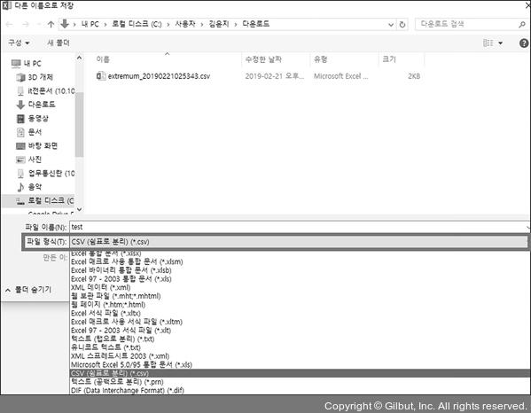

# 기온 데이터 분석 시작하기

기상자료개방포털 : https://data.kma.go.kr  
　  
  
　  
강수량, 전운량, 황사 발생일수 등 기상과 관련된 다양한 데이터가 있다.  
**기후통계분석 -> 기후분석**을 선택하자  
　  
  
　  
조건별통계 페이지에서 기온 정보를 알고 싶은 지역과 기간을 설정할 수 있다.  
　  
  
　  
'분류'는 **지상**, '지역/지점'은 **서울**, '요소'는 **기온**으로 선택한다. '기간'은 **일**을 선택한 후 **2002**년으로 설정하고, '조건'의 '월'은 **6월**, '일' 1일 부터 **30**으로 각각 설정한다. 그 후 **검색** 버튼을 누르자.  
　  
  
　  
그래프의 오른쪽 위에 있는  아이콘을 클릭하면 이미지 파일로 저장할 수 있습니다. 또한, 그래프의 오른쪽 아래에 있는  버튼을 클릭하면 CSV(Comma Separated Values) 파일로 저장할 수 있습니다.  
　  
  
　   
  
　  
csv파일은 다음과 같이 엑셀 파일처럼 사용할 수 있다. 또한 '메모장'같은 텍스트 편집기로도 CSV 파일을 열어 수정하고 생성할 수 있다.  
　  
  
　  
오른쪽 버튼을 클릭하여 연결 프로그램 -> 메모장을 선택하면 CSV 파일을 메모장에서 열 수 있다.  
　  
  
　  
메모장으로 CSV 파일을 열면 데이터가 콤마(,)로 구분되어 있다는 것을 알 수 있다.  
　  
  
　  
파일 -> 다른 이름으로 저장을 누르고 파일 형식에서 CSV(쉼표로 분리)를 선택해주세요  
　  
  
　  
